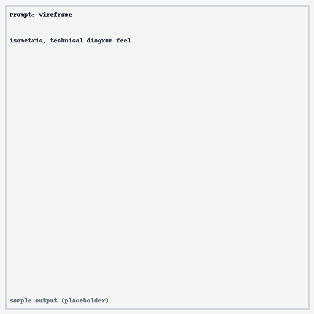

# Vrynt ML Internship — STT, Diffusion, Style Transfer (2022)

Speech-to-Text on SageMaker (Wav2Vec2) with a Streamlit client, CLIP‑guided diffusion, and neural style transfer prototypes. Includes OCI→AWS migration notes, runnable notebooks, and light CI.

**Context.** Vrynt generated user‑requested images from text prompts with selectable art styles. Neural style transfer applied style presets to user images for fast, high‑quality results.

**My role.**
- Deployed Wav2Vec2 STT on Amazon SageMaker (endpoint + runbook) and shipped a Streamlit upload/inference client.
- Prototyped CLIP‑guided diffusion and built a parameterized CLI/UI for reproducible image generation.
- Implemented neural style transfer (VGG baseline) and documented usage.
- Designed and documented the OCI→AWS pipeline (migration steps, integration patterns), enabling runtime style‑transfer operations.

## Highlights
- **SageMaker endpoint (Wav2Vec2)** for real‑time STT with Hugging Face model artifacts; includes deploy script + handler stub.  
- **Streamlit demo app** that accepts audio and invokes the SageMaker endpoint.  
- **Engineering notes** summarizing diffusion/CLIP explorations and deployment runbooks, distilled into docs for fast reviewer access.  
- **Reproducible path**: minimal infra assumptions; works from a dev laptop with AWS credentials set.

---

---

## Results Gallery
Example outputs are shown below for quick visual scanning on GitHub. When you run the CLI or Streamlit app,
new images will be saved to `outputs/` and can be added here as needed.

<p align="center">
  
  
  
  <br/>
  
  
  
</p>

## Quickstart

### 1) Clone & environment
```bash
git clone https://github.com/ajung23/vrynt-ml-internship.git
cd vrynt-ml-internship
python -m venv .venv && source .venv/bin/activate
pip install -r requirements.txt
```

### 2) Configure AWS credentials
Use an IAM role with permission for SageMaker, S3, and CloudWatch Logs.
```bash
aws configure
# or set env vars: AWS_ACCESS_KEY_ID, AWS_SECRET_ACCESS_KEY, AWS_DEFAULT_REGION
```

### 3) (Option A) Deploy a Hugging Face Wav2Vec2 endpoint
```bash
python aws/deploy_sagemaker_endpoint.py   --model-id facebook/wav2vec2-base-960h   --endpoint-name vrynt-stt-demo   --instance-type ml.m5.xlarge
```

### 4) (Option B) Use an existing endpoint
If you already have an endpoint (e.g., `vrynt-stt-demo`), skip deploy and go straight to the app:
```bash
streamlit run app/streamlit_app.py --   --endpoint-name vrynt-stt-demo --region us-east-1
```

---

---

## Screenshots
<p align="center">
  
  &nbsp;&nbsp;
  
</p>

---

## Diffusion demo (optional)
Run the lightweight Streamlit UI for text-to-image (CPU or GPU):

```bash
streamlit run app/diffusion_app.py -- --model-id runwayml/stable-diffusion-v1-5
```
## Repo layout
```
vrynt-ml-internship/
├─ app/
│  └─ streamlit_app.py          # simple demo client for audio upload + inference
├─ aws/
│  ├─ deploy_sagemaker_endpoint.py  # one-file deploy for HF Wav2Vec2
│  ├─ inference.py                  # handler skeleton (TorchServe-style signature)
│  └─ requirements.txt              # minimal server deps
├─ docs/
│  ├─ architecture.md           # concise diagrams + notes
│  └─ SECURITY_AND_COSTS.md     # guardrails & rough cost footprint
├─ notebooks/                   # (placeholders) repro exploration notebooks
│  ├─ 00_wav2vec2_feasibility.ipynb
│  └─ 10_clip_diffusion_expts.ipynb
├─ scripts/                     # small utilities
│  └─ transcribe_local.py
├─ .gitignore
├─ LICENSE
├─ requirements.txt             # local app reqs
└─ README.md
```

---

## Tech stack
- **Model**: Wav2Vec2 base 960h (HF) for STT
- **Cloud**: AWS SageMaker (endpoint), S3 for model/artifacts, CloudWatch Logs
- **App**: Streamlit client (audio upload -> invoke endpoint via `boto3`)
- **Ops**: Single‑file deploy, structured logs, minimal infra assumptions

---

## Demo: how it works
1. User uploads `.wav` / `.mp3` file in the Streamlit UI.  
2. Client serializes bytes with `application/x-audio` content type and calls the endpoint.  
3. Endpoint deserializes audio, runs inference with Wav2Vec2, and returns the transcript JSON.  
4. UI prints transcript and shows basic latency.

---

## Notes & context
- The STT plan and deploy steps mirror the runbook I wrote during the internship (public, redacted version in `docs/`).
- I also explored **CLIP + diffusion** pipelines and on‑device inference to inform early experiments and business demos—captured briefly in `docs/architecture.md` for context.

---

## License
MIT (see `LICENSE`).

---

## Contact
If you’d like to discuss the implementation details or see private, permissioned code, DM me on GitHub.

---
## Diffusion CLI

Use a small, dependency-light wrapper around **diffusers** to reproduce text-to-image and img2img experiments.

```bash
python scripts/diffusion_cli.py --prompt "clean studio product mockup" --steps 30 --guidance-scale 7.5
```

See `docs/clip_guided_diffusion.md` for parameter mapping and tips.